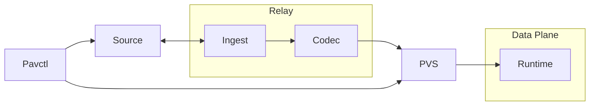
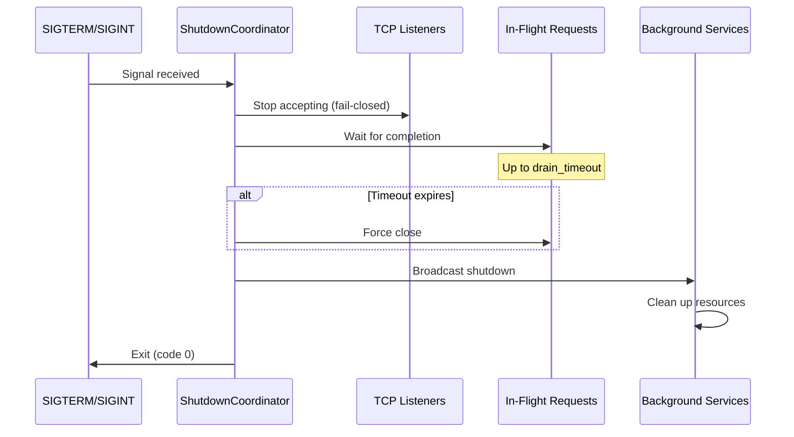

# Architecture: Frozen Data Plane

## 1. Overview

Pavis implements the **Frozen Data Plane** architecture. This model rejects the traditional "Smart Proxy" approach where the data plane performs complex parsing, validation, and policy inference at runtime.

Instead, Pavis treats configuration as a compilation target. All routing logic, security policies, and defaults are resolved **Ahead-of-Time (AOT)** by a Codec pipeline. The runtime executes a binary artifact (`.pvs`) that is guaranteed to be valid, complete, and immutable.

### 1.1 Compile-Time Resolution Pipeline



The data flow is unidirectional and strictly typed:
**Ingest → SourceArtifact → Codec → RuntimeConfig → Relay → PVS Artifact → Runtime**.

This pipeline enforces the Frozen model:
*   **Ingest**: Raw I/O. No interpretation.
*   **Codec**: Compilation. Resolves defaults, validates semantics, and freezes policy.
*   **Runtime**: Execution. Pure mechanism; no policy capability.

### 1.2 Inbound & Outbound Scope

The Frozen Data Plane model unifies Inbound (Ingress) and Outbound (Sidecar) traffic under a single deterministic constraint.

*   **Outbound (Sidecar)**: The primary deployment model. Configuration scope is bounded to local application dependencies.
*   **Inbound (Ingress)**: Fully supported within the Frozen Data Plane model. Use-cases requiring dynamic state (e.g., OIDC flows, Redis-backed Rate Limiting) are explicitly rejected by design. All Inbound policies must be resolvable Ahead-of-Time.

### 1.3 Terminology

- **SourceArtifact**: Raw input bytes (YAML, xDS Protobuf) + metadata.
- **PVS Artifact**: The frozen, zero-copy binary artifact executed by the runtime.
- **RuntimeConfig**: The fully materialized, in-memory representation of the frozen state.

### 1.4 Non-Goals

Pavis is strictly scoped to enforce architectural discipline. It intentionally avoids features that compromise the Frozen Data Plane model.

*   **Not a General-Purpose L7 Gateway**: Pavis does not support arbitrary L7 manipulation, OIDC flows, or complex ingress logic that requires dynamic state.
*   **No Runtime Extensibility**: There is no support for WASM, Lua, or other runtime scripting. All policy logic must be compiled into the native Rust binary.
*   **No Partial Recovery**: Configuration is atomic. If any part of a `.pvs` artifact is invalid, the entire artifact is rejected. There is no "best-effort" loading.
*   **No Envoy Parity**: Pavis consumes xDS as an input format but does not aim for behavioral parity with Envoy. It implements its own opinionated semantics.

## 2. Components & Boundaries

| Component              | Description                                                                                       |
| :--------------------- | :------------------------------------------------------------------------------------------------ |
| **`pavis`**            | **Runtime Engine**. Executes frozen `.pvs` artifacts. **Cannot** validate or infer policy.      |
| **`pavis-core`**       | **Protocol**. Defines the frozen schema and memory layout.                                        |
| **`pavis-relay`**      | **Distribution**. Distributes frozen artifacts. **Pass-through** only; no logic modification.     |
| **`pavis-codec-*`**    | **Compilers**. Transform source intent into frozen `RuntimeConfig`. Owns all policy decisions.    |
| **`pavis-ingest-*`**   | **Ingest**. Handles connectivity to dynamic sources (xDS, K8s API).                               |
| **`pavis-pvs`**        | **Integrity**. Ensures the artifact has not been mutated since compilation.                       |

### 2.1 Responsibilities

The architecture enforces strict separation of concerns to maintain the "Frozen" invariant.

| Responsibility     | Component        | Description                                                                                        |
| :----------------- | :--------------- | :------------------------------------------------------------------------------------------------- |
| **Compilation**    | `pavis-codec-*`  | Compiles vague source intent into explicit, deterministic configuration. Populates all defaults.   |
| **Distribution**   | `pavis-relay`    | Versions and distributes artifacts. **Must not** validate or modify the payload.                   |
| **Execution**      | `pavis`          | Zero-copy execution. **Rejected by Design**: Logic for defaults, inference, or partial validity.   |

## 3. Configuration Architecture: Frozen State

This section defines how the Frozen Data Plane model is enforced through the configuration pipeline.

### 3.1 Pipeline Stages
Configuration **MUST** proceed through these stages. The Runtime cannot accept input from earlier stages.

1.  **SourceArtifact → CheckedArtifact** (Codec): Verify framing.
2.  **CheckedArtifact → RuntimeConfig** (Codec): **Compilation Phase**. Parse, normalize, and populate semantic defaults. The output is a complete, explicit policy.
3.  **RuntimeConfig → ValidatedRuntimeConfig** (Codec): **Validation Phase**. Enforce invariants (e.g., regex safety) before the artifact is sealed.

### 3.2 Architectural Invariants

The following rules are absolute consequences of the Frozen Data Plane.

#### Codec Layer (`pavis-codec-*`)
*   **Role:** Compiler.
*   **Responsibility:** **Materialize Policy**. All "magic" (implicit behaviors) must be converted to explicit configuration instructions.
*   **Output:** A deterministic `RuntimeConfig`.

#### Runtime Layer (`pavis`)
*   **Role:** Executor.
*   **Input:** STRICTLY `ValidatedRuntimeConfig` (via `.pvs`).
*   **Invariant:** **Frozen Logic**. The runtime has no logic to apply semantic defaults (e.g., "missing timeout means 5s"). `None` means "Disabled", never "Default".
*   **Invariant:** **Immutable State**. Configuration cannot be mutated after load.
*   **Failure:** The runtime fails immediately if the artifact is structurally invalid; it does not attempt recovery or compensation.

#### .pvs Artifacts
*   **Nature:** Sealed Execution Contract.
*   **Guarantee:** The `.pvs` artifact is a self-contained, versioned binary.
    *   **Forward Compatibility:** Explicitly unsupported. The Runtime **MUST** reject artifacts with a newer schema version than it understands.
    *   **Backward Compatibility:** Handled exclusively in the Codec. The Runtime is kept simple and does not contain compatibility shims for older artifact versions.
    *   **Immutability:** Once generated, the artifact represents a final, unchangeable state.

## 4. Tooling Contracts (Bench/Test)

Benchmark and test runners emit shell-sourceable `context.env` files to capture runtime context and eliminate silent failures:

- **Bench Run-Scoped**: `bench/output/{mode}/context.env`
- **Bench Case-Scoped**: `bench/output/{mode}/{proxy}/{case}/context.env`
- **Test Run-Scoped**: `tests/temp/context.env`
- **Test Case-Scoped**: `${TEST_TMP}/context.env`

These artifacts are for observability and debugging; they do not affect runtime behavior or configuration semantics.
On non-Linux hosts, benchmark CPU pinning and memory limits are skipped because `taskset` is unavailable; Linux workstation runs still require `taskset` to enforce pinning.
Standalone benchmark case scripts default to `bench/docker-compose.yaml` and source `bench/scripts/pretty.sh` for shared formatting.

### 3.4 Frozen Runtime State

The Runtime consumes a configuration where all policy decisions have been made at **compile time**.

*   **Explicit State**: Features are `Enabled` or `Disabled`. There is no `Auto` state at runtime (except for system resources like threads).
*   **No Inference**: The Runtime executes instructions; it does not infer intent. "Missing" configuration is a compile-time error, not a runtime default.
*   **Deterministic Time**: Timeouts are materialized as fixed `u32` milliseconds.

## 4. Implementation Internals

### 4.1 Runtime Engine Internals

Pavis operates as an L7 proxy. Its pipeline is fixed and optimized for the frozen model:

1.  **Accept**: TCP accept.
2.  **Handshake**: TLS/mTLS handshake using explicit certificates defined in the frozen config.
3.  **Decode**: HTTP/1.1 or H2 parsing.
4.  **Policy**: Enforce frozen RBAC and validation rules immediately after decoding.
5.  **Match**: `Router` executes O(1) or O(log N) lookups against the frozen routing table.
6.  **Action**: Executes the pre-compiled `RouteAction` (Load Balance, Forward, or Reject).
7.  **Telemetry**: Emits metrics, traces, and access logs. Cardinality is bounded by frozen `route_pattern`.

### 4.2 Runtime Memory Lifecycle (RCU)

Hot reloading is strictly defined as **atomic state replacement, not mutation**. The Runtime never modifies the active configuration structure.

1.  **Stage**: Download `.pvs`.
2.  **Verify**: Cryptographic verification of the frozen artifact.
3.  **Map**: Memory-map the artifact.
4.  **Swap**: Atomic replacement of the configuration pointer (ArcSwap).
5.  **Reclaim**: Old state is dropped when the last active request completes.

Throughout this process, the `RuntimeConfig` remains immutable.

### 4.3 Networking & Discovery

Discovery is the *only* mutable aspect of the runtime, strictly bounded to endpoint selection.

1.  **Static**: Fixed IPs compiled into the artifact.
2.  **StrictDns / LogicalDns**: The runtime updates endpoint lists based on TTL. This is **mechanism**, not policy. The *decision* to use DNS and the TTL parameters are frozen in the config.

**Outbound TLS SNI Resolution**
*   **Deterministic**: `SniName::Auto` resolves to a host rewrite override when present, else a DNS endpoint hostname, else Disabled.
*   **Fail-Closed**: `TlsVerify::Full` requires SNI `Auto` or `Name`. If Auto resolves to Disabled, the config is rejected.
*   **DNS Support**: DNS endpoints are supported at runtime; resolution failures fail the request and are logged.

**TLS Backend Architecture**

Pavis delegates TLS functionality to Pingora, which abstracts over rustls and OpenSSL/BoringSSL. The backend is selected at compile time.

**Rustls Backend (Default)**:
- Minimal dependencies, smaller binary size
- Blocked features: inbound mTLS, per-peer CA verification
- Suitable for: outbound-only proxies, system CA trust model

**OpenSSL/BoringSSL Backend**:
- Full TLS feature set
- Required for: inbound mTLS, private CA environments, client cert presentation
- Larger dependency footprint

The Runtime does not abstract over backend differences. Feature availability is determined entirely by the build-time backend selection. Configuration validation in `pavis-core` accepts all TLS fields regardless of backend; runtime enforcement depends on Pingora's capabilities.

### 4.4 Resilience Policies (Phase 6)

Pavis implements bounded, frozen resilience policies that are fully materialized in `RuntimeConfig` and enforced at runtime. All state is ephemeral and is reset on hot reload.

*   **Outlier Detection (Passive)**:
    *   Trigger: consecutive upstream failures (transport errors or HTTP 5xx responses).
    *   Action: eject the endpoint for a fixed `eject_duration`; no half-open probing.
    *   Scope: per-endpoint counters, per-upstream policy.
*   **Circuit Breaking**:
    *   Scope: per-upstream caps on in-flight requests and queued (pending) requests.
    *   Behavior: when limits are exceeded, the request is rejected immediately with HTTP 503.
    *   Accounting: limits are request-scoped (H2 multiplexing counts per request, not per TCP connection).
*   **Active Health Checks**:
    *   Probe: periodic `GET` to the configured `path`, no body.
    *   Success: HTTP 2xx. Failures include non-2xx or timeout.
    *   Initial State: fail-open (endpoints start healthy until proven unhealthy).
    *   TLS: honors upstream TLS policy (verify mode + CA bundle). Host header is derived from SNI or DNS endpoint host when available. Health checks do not override SNI for IP endpoints; TLS verification may fail if the endpoint address does not match certificate SANs.

### 4.5 Routing Algorithm (Hot Path)

Routing uses static, optimized structures built during the artifact compilation phase (or mapped directly).
*   Regexes are compiled once during the "Swap" phase.
*   No runtime script evaluation (Lua/WASM) occurs during routing.

### 4.6 xDS Codec Architecture

The xDS Codec functions as a **Compiler**:
1.  **Decode**: Unmarshal Envoy Protobuf.
2.  **Normalize**: Flatten disparate xDS resources into a coherent model.
3.  **Map**: Transform Envoy semantics into Pavis frozen semantics.
4.  **Validate**: Final pass before artifact generation.

**Note:** Pavis treats xDS as an input language, not a behavioral contract. It does **NOT** aim for semantic equivalence with Envoy. Where xDS concepts conflict with the Frozen Data Plane (e.g., dynamic scripting), they are rejected or mapped to deterministic equivalents.

The Runtime **never** connects to xDS directly; this would violate the Frozen Data Plane model by introducing runtime complexity and non-determinism.

### 4.6 Config Serving API

The relay exposes a single endpoint for config retrieval with ETag-based validation and optional long-polling:

**Endpoint:** `GET /v1/config?wait_ms=<milliseconds>`

**Headers:**
- `If-None-Match: "<etag>"` - Optional conditional request validator

**Responses:**

| Status | Condition | Headers | Body |
|--------|-----------|---------|------|
| 200 OK | Config available (changed or unconditional) | `Content-Type`, `ETag`, `x-config-size`, `Cache-Control`, (`x-config-version`) | .pvs artifact bytes |
| 204 No Content | Long-poll timeout (ETag unchanged) | `ETag`, `Cache-Control` | Empty |
| 304 Not Modified | Conditional GET, ETag matches (no long-poll) | `Cache-Control`, `ETag` | Empty |
| 400 Bad Request | Invalid `wait_ms` (>60000) | `Content-Type` | Error message |
| 503 Service Unavailable | No config published yet | `Retry-After` | Empty |

**ETag Format:**
- Strong ETags only: `"sha256:<64-hex-chars>"`
- Derived from artifact checksum (content hash)
- Server normalizes to lowercase hex; parser accepts case-insensitive hex
- Quoted in HTTP responses (`"sha256:..."`), unquoted internally (`sha256:...`)
- Strict parsing: rejects weak ETags (W/), wildcards (*), multiple ETags, malformed quotes

**Long-Poll Semantics:**
- `wait_ms` parameter controls timeout (valid range: `0..=60000` milliseconds inclusive)
- `wait_ms=0` or omitted -> no long-poll (immediate response)
- Only `wait_ms > 60000` returns 400 Bad Request
- Only wakes on actual ETag change (false wakeup protection at two levels):
  1. Notification source: `publish_*()` only notifies if checksum changes
  2. Long-poll loop: defensive re-check after wake, continues waiting if ETag unchanged
- Missing `If-None-Match` + `wait_ms > 0` -> immediate 200 OK (spec recommendation)
- Timeout -> 204 No Content

**Transport Integrity:**
- All 200 responses include `x-config-size` for body verification
- Clients SHOULD validate response body size matches header
- `.pvs` artifacts contain internal checksums validated by `pavis-pvs`

## 5. Relay Versioning & Distribution

The relay serves as a central distribution point for frozen PVS artifacts. This section describes the relay's versioning model, storage architecture, and crash recovery guarantees.

### 5.1 Versioning Model

**Core Principle:** Relay owns version generation. Clients consume versions, never propose them.

#### Version Semantics

- **Relay-Generated Only**: Versions are assigned by the relay during publish (clients cannot influence)
- **Monotonic Invariant**: `new_version = current_version + 1` (strict increment, never skip)
- **Version 0 Sentinel**: Represents "no published configuration" (bootstrap state)
- **Schema Independence**: Relay version ≠ PVS schema version (independent concerns)
- **Idempotency**: Publishing identical artifacts creates distinct versions with identical checksums

**Rationale:** Relay-generated versioning eliminates distributed consensus problems. The relay is the single source of truth for "what is the current version?"

#### Version Authority

The file `lkg/meta.json` (LKG metadata) is the **authoritative source** for current version:
- `state.json` is a cache only (derived from LKG, can be rewritten)
- On startup: version is loaded from `lkg/meta.json`, not `state.json`
- On mismatch: `state.json` is discarded and regenerated

### 5.2 Storage Architecture

#### Directory Layout

```
/var/lib/pavis-relay/
├── state.json              # Version cache (derived, not authoritative)
├── lkg/                    # Last Known Good
│   ├── config.pvs          # Current artifact
│   └── meta.json           # LKG metadata (AUTHORITATIVE)
└── history/                # Historical artifacts
    ├── 0000000001.pvs
    ├── 0000000001.meta.json
    ├── 0000000002.pvs
    ├── 0000000002.meta.json
    └── ...
```

#### Storage Invariants

1. **LKG metadata is source of truth**: `lkg/meta.json` defines current version
2. **state.json is a cache**: Derived from LKG, rewritten on mismatch
3. **History is append-only**: Manual GC only (no automatic deletion)
4. **Flat directory layout**: No subdirectory bucketing (deferred until needed)

#### Metadata Format

All metadata files use JSON serialization:

```json
{
  "version": 42,
  "published_at": "2026-01-16T12:00:00Z",
  "checksum": "sha256:a3f8d7e2c1b9f6e4...",
  "size": 2048
}
```

**Checksum Format:** `sha256:{64 hex chars}` computed over artifact bytes.

### 5.3 Publish Flow Atomicity

#### Ordered Steps

Publish proceeds in strict order to ensure crash safety:

```
1. Validate PVS artifact           (in-memory, fail-fast)
2. Compute checksum                (sha256 over bytes)
3. Create metadata                 (version, timestamp, checksum, size)
4. Write history/{version}.pvs          (atomic: write-tmp-rename-fsync)
5. Write history/{version}.meta.json    (atomic: write-tmp-rename-fsync)
6. Write lkg/config.pvs.tmp → rename    (atomic promotion)
7. Write lkg/meta.json.tmp → rename     (atomic promotion)
8. Update state.json                    (best-effort, non-critical)
9. Wake long-poll waiters               (in-memory notification)
```

**Success Criterion:** Publish succeeds **if and only if** LKG promotion completes (steps 6-7).

**Failure Handling:**
- Version increments **only** after successful LKG promotion
- On failure before step 6: rollback (delete history entry, best-effort)
- On failure after step 6: partial LKG triggers recovery on next startup

**Concurrency Control:** Publishes are serialized via mutex to prevent races.

### 5.4 Crash Recovery

The relay is designed to survive crashes at any point in the publish flow.

#### Recovery Invariants

1. **LKG Consistency**: `lkg/meta.json` presence implies `lkg/config.pvs` exists
2. **Metadata Authority**: `lkg/meta.json` version is always authoritative
3. **Orphan Safety**: History entries with `version > current_version` are safe to ignore
4. **Checksum Integrity**: LKG artifact checksum must match metadata checksum

#### Automatic Recovery on Startup

On every startup, the relay executes `repair_lkg()`:

```
1. Check if lkg/meta.json exists
   - YES: Load version → verify artifact exists → proceed
   - NO: Check if lkg/config.pvs exists
     - YES: Attempt recovery from history
     - NO: Bootstrap (version = 0)

2. If LKG incomplete (artifact OR metadata missing):
   - Scan history for matching version
   - Copy history/{version}.{pvs,meta.json} to lkg/
   - If recovery fails: FATAL ERROR

3. Verify state.json matches lkg/meta.json version
   - MISMATCH: Rewrite state.json from LKG
   - MISSING: Create state.json from LKG

4. Scan history/ for issues
   - Orphans (version > current_version): Log warning, safe to ignore
   - Corrupt (missing .pvs or .meta.json): Log warning, manual cleanup
```

#### Recovery Scenarios

| Crash After | State | Recovery |
|------------|-------|----------|
| Step 1-3 (validation) | No files written | Version unchanged, safe |
| Step 4-5 (history) | Orphaned history entry | Ignored on startup, manual cleanup |
| Step 6 (partial LKG) | Artifact without metadata | Recover from history or delete |
| Step 7 (complete LKG) | state.json stale | Rewrite state.json from LKG |
| Step 8-9 (success) | All consistent | Normal startup |

**Key Design Decision:** Orphaned history entries are **not** auto-deleted. Conservative approach allows forensic analysis and manual cleanup.

### 5.5 Client Change Detection

Clients use **checksum-based change detection** rather than version comparison.

#### Why Checksums?

Version-based change detection has a race condition:
- Client polls with version N
- Relay publishes N+1 while client is waiting
- Client receives N+1 but was not waiting when publish occurred
- Long-poll wake only benefits clients already waiting

**Solution:** Always return checksum in response headers. Clients compare checksums.

#### API Contract

**GET /v1/config** response headers:
```
X-Config-Checksum: sha256:abc123...  (use for change detection)
X-Config-Size: 1234
X-Config-Version: 42  (observability only)
```

**Client Responsibilities:**
1. Extract `X-Config-Checksum` from response headers
2. Compute `sha256(response_body)` and verify it matches header
3. Compare header checksum with previous value
4. Apply config only if checksum differs
5. **Fail-closed** on checksum mismatch (do not apply corrupted config)

#### Long-Polling

Clients use `GET /v1/config?timeout=30` for efficient polling:
- If publish occurs while waiting → wake immediately, return LKG
- If timeout expires → return current LKG (may be unchanged)
- Checksum comparison determines if update is needed

### 5.6 Performance Optimization: Checksum Caching

The relay caches artifact checksums in-memory to avoid redundant computation.

**Problem:** Computing SHA256 on every GET request (1-2ms per request for 1MB artifact)

**Solution:**
- Checksum computed **once** during publish
- Cached in `RelaySnapshot.artifact_checksum`
- GET /v1/config returns cached value (0.001ms)

**Performance Gain:** 1000x faster checksum retrieval

### 5.7 Sequence Diagrams

#### Publish Flow

```
Client              Relay                Storage
  │                   │                     │
  │─POST /v1/publish─▶│                     │
  │                   │                     │
  │                   │──1. Validate PVS────│
  │                   │──2. Compute checksum│
  │                   │──3. Create metadata─│
  │                   │                     │
  │                   │──4. Write history──▶│
  │                   │◀──────────────────ack
  │                   │                     │
  │                   │──5. Promote to LKG─▶│
  │                   │◀──────────────────ack
  │                   │                     │
  │                   │──6. Update state.json (best-effort)
  │                   │                     │
  │                   │──7. Wake waiters────│
  │                   │                     │
  │◀───200 OK─────────│                     │
  │   {version: 42}   │                     │
```

#### Long-Poll Flow

```
Client              Relay                Storage
  │                   │                     │
  │──GET /v1/config──▶│                     │
  │   ?timeout=30     │                     │
  │                   │                     │
  │         ┌─────────┴─────────┐           │
  │         │ Wait for publish  │           │
  │         │  or timeout (30s) │           │
  │         └─────────┬─────────┘           │
  │                   │                     │
  │         ┌─────────┴─────────┐           │
  │         │ Publish occurs OR │           │
  │         │ timeout expires   │           │
  │         └─────────┬─────────┘           │
  │                   │                     │
  │                   │──Read LKG──────────▶│
  │                   │◀───────────(bytes, checksum)
  │                   │                     │
  │◀───200 OK─────────│                     │
  │   Headers:        │                     │
  │   X-Config-Checksum: sha256:...         │
  │   Body: PVS bytes │                     │
  │                   │                     │
  │──Verify checksum──│                     │
  │──Compare with prev│                     │
  │──Apply if changed─│                     │
```

#### Crash Recovery Flow

```
Startup             Relay                Storage
  │                   │                     │
  │───Start───────────▶│                     │
  │                   │                     │
  │                   │──1. Load LKG meta──▶│
  │                   │◀────(version=42)────│
  │                   │                     │
  │                   │──2. Verify artifact▶│
  │                   │◀─────exists?────────│
  │                   │                     │
  │         ┌─────────┴─────────┐           │
  │         │ If artifact       │           │
  │         │ missing: recover  │           │
  │         │ from history      │           │
  │         └─────────┬─────────┘           │
  │                   │                     │
  │                   │──3. Verify state────▶│
  │                   │◀────(stale)─────────│
  │                   │                     │
  │                   │──4. Rewrite state───▶│
  │                   │◀──────────────────ack
  │                   │                     │
  │                   │──5. Scan orphans────▶│
  │                   │◀──(log warnings)────│
  │                   │                     │
  │◀───Ready──────────│                     │
  │   (version=42)    │                     │
```

### 5.8 Operational Considerations

**Backup Strategy:**
- Critical: `lkg/` directory (source of truth)
- Important: `history/` directory (recovery source)
- Optional: `state.json` (regenerated on startup)

**History Cleanup:**
- Manual only (no automatic GC)
- Keep at least last N versions (recommendation: 10+)
- Never delete LKG version from history

**Monitoring:**
- `pavis_relay_version` - Current version (should increment on publish)
- `pavis_relay_publish_ok_total` - Successful publishes
- `pavis_relay_publish_fail_total` - Failed publishes (investigate if increasing)

**See Also:**
- [Relay API Reference](docs/api/relay.md)
- [Operations Guide](docs/operations/relay.md)
- [Crash Recovery Guide](docs/operations/crash-recovery.md)

## 6. Operational Lifecycle

### 6.1 Graceful Shutdown

Pavis implements graceful shutdown to ensure in-flight requests complete before the process exits.

#### Shutdown Policy

The `shutdown` configuration controls shutdown behavior:

```yaml
shutdown:
  enabled: true           # Default: true (graceful shutdown enabled)
  drain_timeout_ms: 30000 # Default: 30 seconds
```

**States:**
- **Disabled**: Exit immediately on SIGTERM/SIGINT (no drain)
- **Enabled**: Wait for in-flight requests up to `drain_timeout` before force-close

#### Shutdown Flow



#### Connection Handling

| Connection Type | Behavior During Drain |
|----------------|----------------------|
| **In-flight requests** | Wait for completion (up to timeout) |
| **Keep-alive idle** | Close immediately |
| **WebSocket/SSE** | Not supported (Phase 7) |

#### Configuration Recommendations

- **Production**: `drain_timeout_ms: 30000` (30s) - allows graceful completion
- **Development**: `enabled: false` - fast iteration cycle
- **High-traffic**: `drain_timeout_ms: 60000` (60s) - longer drain for slow requests

### 6.2 Admin API

The admin API provides **read-only** operational endpoints for health checks and runtime statistics.

#### Configuration

```yaml
admin:
  enabled: false              # Default: false (disabled)
  address: "127.0.0.1:9901"   # Default: loopback only
```

**Security Note:** The admin API has **no authentication** in Phase 7. Bind to loopback (`127.0.0.1`) or use firewall rules to restrict access.

#### Endpoints

| Endpoint | Method | Description | Response |
|----------|--------|-------------|----------|
| `/health` | GET | Health status | `{"status":"healthy"}` (always 200 OK) |
| `/stats` | GET | Runtime statistics | JSON with version, uptime, config counts |

#### Stats Response Schema

```json
{
  "version": "0.0.0",
  "uptime_seconds": 3600,
  "listeners": 2,
  "upstreams": 5,
  "routes": 10
}
```

**Safe Data:** Version strings, counters, timestamps, config counts (listener/upstream/route counts)

**Forbidden Data:** Listener addresses, upstream IPs, TLS paths, route patterns, raw config bytes, secrets

#### Usage Examples

```bash
# Health check
curl http://127.0.0.1:9901/health
# {"status":"healthy"}

# Runtime statistics
curl http://127.0.0.1:9901/stats
# {"version":"0.0.0","uptime_seconds":120,"listeners":1,"upstreams":3,"routes":5}
```

#### Integration with Monitoring

The admin API complements the metrics endpoint (`telemetry.metrics`):
- **Metrics endpoint** (`/metrics`): Prometheus-formatted time-series data
- **Admin API** (`/health`, `/stats`): Structured JSON for health checks and basic introspection

**Kubernetes Health Checks:**
```yaml
livenessProbe:
  httpGet:
    path: /health
    port: 9901
  initialDelaySeconds: 5
  periodSeconds: 10
```

### 6.3 Signal Handling

Pavis responds to the following signals:

| Signal | Behavior |
|--------|----------|
| **SIGTERM** | Graceful shutdown (respects `drain_timeout`) |
| **SIGINT** | Graceful shutdown (respects `drain_timeout`) |
| **SIGKILL** | Immediate termination (cannot be caught) |

**Best Practice:** Use SIGTERM for graceful termination. Avoid SIGKILL except as last resort.
