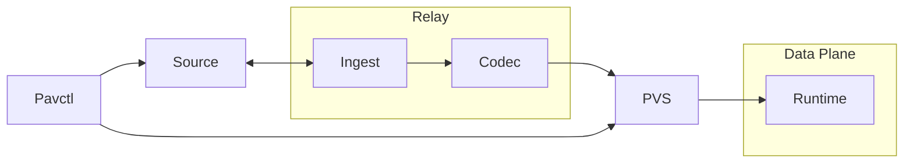

# Architecture: Frozen Data Plane

## 1. Overview

Pavis implements the **Frozen Data Plane** architecture. This model rejects the traditional "Smart Proxy" approach where the data plane performs complex parsing, validation, and policy inference at runtime.

Instead, Pavis treats configuration as a compilation target. All routing logic, security policies, and defaults are resolved **Ahead-of-Time (AOT)** by a Codec pipeline. The runtime executes a binary artifact (`.pvs`) that is guaranteed to be valid, complete, and immutable.

### 1.1 Compile-Time Resolution Pipeline

The data flow is unidirectional and strictly typed:
**Ingest → SourceArtifact → Codec → RuntimeConfig → Relay → PVS Artifact → Runtime**.

This pipeline enforces the Frozen model:
*   **Ingest**: Raw I/O. No interpretation.
*   **Codec**: Compilation. Resolves defaults, validates semantics, and freezes policy.
*   **Runtime**: Execution. Pure mechanism; no policy capability.

### 1.2 Inbound & Outbound Scope

The Frozen Data Plane model unifies Inbound (Ingress) and Outbound (Sidecar) traffic under a single deterministic constraint.

*   **Outbound (Sidecar)**: The primary deployment model. Configuration scope is bounded to local application dependencies.
*   **Inbound (Ingress)**: Fully supported within the Frozen Data Plane model. Use-cases requiring dynamic state (e.g., OIDC flows, Redis-backed Rate Limiting) are explicitly rejected by design. All Inbound policies must be resolvable Ahead-of-Time.

### 1.3 Terminology

- **SourceArtifact**: Raw input bytes (YAML, xDS Protobuf) + metadata.
- **PVS Artifact**: The frozen, zero-copy binary artifact executed by the runtime.
- **RuntimeConfig**: The fully materialized, in-memory representation of the frozen state.

### 1.4 Non-Goals

Pavis is strictly scoped to enforce architectural discipline. It intentionally avoids features that compromise the Frozen Data Plane model.

*   **Not a General-Purpose L7 Gateway**: Pavis does not support arbitrary L7 manipulation, OIDC flows, or complex ingress logic that requires dynamic state.
*   **No Runtime Extensibility**: There is no support for WASM, Lua, or other runtime scripting. All policy logic must be compiled into the native Rust binary.
*   **No Partial Recovery**: Configuration is atomic. If any part of a `.pvs` artifact is invalid, the entire artifact is rejected. There is no "best-effort" loading.
*   **No Envoy Parity**: Pavis consumes xDS as an input format but does not aim for behavioral parity with Envoy. It implements its own opinionated semantics.

## 2. Components & Boundaries

| Component              | Description                                                                                       |
| :--------------------- | :------------------------------------------------------------------------------------------------ |
| **`pavis`**            | **Runtime Engine**. Executes frozen `.pvs` artifacts. **Cannot** validate or infer policy.      |
| **`pavis-core`**       | **Protocol**. Defines the frozen schema and memory layout.                                        |
| **`pavis-relay`**      | **Distribution**. Distributes frozen artifacts. **Pass-through** only; no logic modification.     |
| **`pavis-codec-*`**    | **Compilers**. Transform source intent into frozen `RuntimeConfig`. Owns all policy decisions.    |
| **`pavis-ingest-*`**   | **Ingest**. Handles connectivity to dynamic sources (xDS, K8s API).                               |
| **`pavis-pvs`**        | **Integrity**. Ensures the artifact has not been mutated since compilation.                       |

### 2.1 Responsibilities

The architecture enforces strict separation of concerns to maintain the "Frozen" invariant.

| Responsibility     | Component        | Description                                                                                        |
| :----------------- | :--------------- | :------------------------------------------------------------------------------------------------- |
| **Compilation**    | `pavis-codec-*`  | Compiles vague source intent into explicit, deterministic configuration. Populates all defaults.   |
| **Distribution**   | `pavis-relay`    | Versions and distributes artifacts. **Must not** validate or modify the payload.                   |
| **Execution**      | `pavis`          | Zero-copy execution. **Rejected by Design**: Logic for defaults, inference, or partial validity.   |

## 3. Configuration Architecture: Frozen State

This section defines how the Frozen Data Plane model is enforced through the configuration pipeline.

### 3.1 Pipeline Stages
Configuration **MUST** proceed through these stages. The Runtime cannot accept input from earlier stages.

1.  **SourceArtifact → CheckedArtifact** (Codec): Verify framing.
2.  **CheckedArtifact → RuntimeConfig** (Codec): **Compilation Phase**. Parse, normalize, and populate semantic defaults. The output is a complete, explicit policy.
3.  **RuntimeConfig → ValidatedRuntimeConfig** (Codec): **Validation Phase**. Enforce invariants (e.g., regex safety) before the artifact is sealed.

### 3.2 Architectural Invariants

The following rules are absolute consequences of the Frozen Data Plane.

#### Codec Layer (`pavis-codec-*`)
*   **Role:** Compiler.
*   **Responsibility:** **Materialize Policy**. All "magic" (implicit behaviors) must be converted to explicit configuration instructions.
*   **Output:** A deterministic `RuntimeConfig`.

#### Runtime Layer (`pavis`)
*   **Role:** Executor.
*   **Input:** STRICTLY `ValidatedRuntimeConfig` (via `.pvs`).
*   **Invariant:** **Frozen Logic**. The runtime has no logic to apply semantic defaults (e.g., "missing timeout means 5s"). `None` means "Disabled", never "Default".
*   **Invariant:** **Immutable State**. Configuration cannot be mutated after load.
*   **Failure:** The runtime fails immediately if the artifact is structurally invalid; it does not attempt recovery or compensation.

#### .pvs Artifacts
*   **Nature:** Sealed Execution Contract.
*   **Guarantee:** The `.pvs` artifact is a self-contained, versioned binary.
    *   **Forward Compatibility:** Explicitly unsupported. The Runtime **MUST** reject artifacts with a newer schema version than it understands.
    *   **Backward Compatibility:** Handled exclusively in the Codec. The Runtime is kept simple and does not contain compatibility shims for older artifact versions.
    *   **Immutability:** Once generated, the artifact represents a final, unchangeable state.

### 3.4 Frozen Runtime State

The Runtime consumes a configuration where all policy decisions have been made at **compile time**.

*   **Explicit State**: Features are `Enabled` or `Disabled`. There is no `Auto` state at runtime (except for system resources like threads).
*   **No Inference**: The Runtime executes instructions; it does not infer intent. "Missing" configuration is a compile-time error, not a runtime default.
*   **Deterministic Time**: Timeouts are materialized as fixed `u32` milliseconds.

## 4. Implementation Internals

### 4.1 Runtime Engine Internals

Pavis operates as an L7 proxy. Its pipeline is fixed and optimized for the frozen model:

1.  **Accept**: TCP accept.
2.  **Handshake**: TLS/mTLS handshake using explicit certificates defined in the frozen config.
3.  **Decode**: HTTP/1.1 or H2 parsing.
4.  **Policy**: Enforce frozen RBAC and validation rules immediately after decoding.
5.  **Match**: `Router` executes O(1) or O(log N) lookups against the frozen routing table.
6.  **Action**: Executes the pre-compiled `RouteAction` (Load Balance, Forward, or Reject).
7.  **Telemetry**: Emits metrics, traces, and access logs. Cardinality is bounded by frozen `route_pattern`.

### 4.2 Runtime Memory Lifecycle (RCU)

Hot reloading is strictly defined as **atomic state replacement, not mutation**. The Runtime never modifies the active configuration structure.

1.  **Stage**: Download `.pvs`.
2.  **Verify**: Cryptographic verification of the frozen artifact.
3.  **Map**: Memory-map the artifact.
4.  **Swap**: Atomic replacement of the configuration pointer (ArcSwap).
5.  **Reclaim**: Old state is dropped when the last active request completes.

Throughout this process, the `RuntimeConfig` remains immutable.

### 4.3 Networking & Discovery

Discovery is the *only* mutable aspect of the runtime, strictly bounded to endpoint selection.

1.  **Static**: Fixed IPs compiled into the artifact.
2.  **StrictDns / LogicalDns**: The runtime updates endpoint lists based on TTL. This is **mechanism**, not policy. The *decision* to use DNS and the TTL parameters are frozen in the config.

**Outbound TLS SNI Resolution**
*   **Deterministic**: `SniName::Auto` resolves to a host rewrite override when present, else a DNS endpoint hostname, else Disabled.
*   **Fail-Closed**: `TlsVerify::Full` requires SNI `Auto` or `Name`. If Auto resolves to Disabled, the config is rejected.
*   **DNS Support**: DNS endpoints are supported at runtime; resolution failures fail the request and are logged.

**TLS Backend Architecture**

Pavis delegates TLS functionality to Pingora, which abstracts over rustls and OpenSSL/BoringSSL. The backend is selected at compile time.

**Rustls Backend (Default)**:
- Minimal dependencies, smaller binary size
- Blocked features: inbound mTLS, per-peer CA verification
- Suitable for: outbound-only proxies, system CA trust model

**OpenSSL/BoringSSL Backend**:
- Full TLS feature set
- Required for: inbound mTLS, private CA environments, client cert presentation
- Larger dependency footprint

The Runtime does not abstract over backend differences. Feature availability is determined entirely by the build-time backend selection. Configuration validation in `pavis-core` accepts all TLS fields regardless of backend; runtime enforcement depends on Pingora's capabilities.

### 4.4 Routing Algorithm (Hot Path)

Routing uses static, optimized structures built during the artifact compilation phase (or mapped directly).
*   Regexes are compiled once during the "Swap" phase.
*   No runtime script evaluation (Lua/WASM) occurs during routing.

### 4.5 xDS Codec Architecture

The xDS Codec functions as a **Compiler**:
1.  **Decode**: Unmarshal Envoy Protobuf.
2.  **Normalize**: Flatten disparate xDS resources into a coherent model.
3.  **Map**: Transform Envoy semantics into Pavis frozen semantics.
4.  **Validate**: Final pass before artifact generation.

**Note:** Pavis treats xDS as an input language, not a behavioral contract. It does **NOT** aim for semantic equivalence with Envoy. Where xDS concepts conflict with the Frozen Data Plane (e.g., dynamic scripting), they are rejected or mapped to deterministic equivalents.

The Runtime **never** connects to xDS directly; this would violate the Frozen Data Plane model by introducing runtime complexity and non-determinism.
