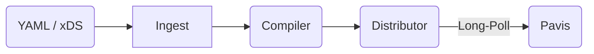

# Pavis

**A Frozen Data Plane L7 Sidecar Proxy**  
_Deterministic by construction. Zero runtime policy._

**Pavis** is a highly opinionated L7 sidecar proxy implemented in Rust, built on the Cloudflare Pingora engine.

It is **NOT** a drop-in replacement for Envoy, nor is it a general-purpose programmable proxy.

Pavis is built on the **Frozen Data Plane** architecture. It separates policy resolution from packet forwarding. Unlike traditional proxies that evaluate complex logic, regular expressions, and defaults at runtime, Pavis executes **only** pre-validated, immutable, Ahead-of-Time (AOT) compiled artifacts.

Pavis eliminates runtime non-determinism by freezing all policy decisions into a zero-copy binary artifact before deployment.

This architectural shift moves complexity left—from the critical path of packet processing to the compilation phase—guaranteeing operational behavior that is verifiable, bounded, and immutable.

## 🧊 Core Philosophy: The Frozen Data Plane

Pavis rejects the "Smart Proxy" model where the data plane is responsible for interpreting vague configuration or executing scripts.

1.  **Immutable Execution**: The runtime executes a static, binary `.pvs` artifact. It cannot load plugins, scripts, or WASM modules.
2.  **No Runtime Inference**: "Missing" configuration is a compile-time error. The runtime has no logic to apply defaults (e.g., a missing timeout causes artifact rejection, not a fallback to 5s).
3.  **Determinism**: By removing runtime programmability and enforcing AOT compilation, resource usage and latency variance are strictly bounded.

This architecture prevents configuration-driven performance regressions, such as thundering herds during reloads or CPU spikes from runtime regex compilation.

This approach eliminates an entire class of production incidents where runtime default resolution or regex compilation causes unexpected latency spikes or resource exhaustion during configuration reloads.

## 🧱 Architecture

Pavis treats configuration as a compilation target, not a runtime input. See [ARCHITECTURE.md](./ARCHITECTURE.md) for a detailed system breakdown.

-   **Runtime (`pavis`)**: A "dumb" execution engine. It maps the `.pvs` file directly into memory (zero-copy) and forwards traffic.
-   **Ingest & Codec**: Transforms sparse human intent (YAML, xDS) into fully explicit, validated `RuntimeConfig`. All heavy lifting (regex compilation, policy resolution) happens here.
-   **Relay**: Distributes frozen artifacts via HTTP long-polling.

The Runtime is deliberately constrained to be a pure execution mechanism. It performs no parsing, no semantic validation, no default injection, and no interpretation of intent. By design, the Runtime lacks the logic required to compensate for malformed or incomplete configurations.

## ✅ Supported Today

*   **L7 Routing**: Prefix, Exact, and Regex matching (Compiled AOT).
*   **Traffic Management**: Weighted traffic splitting and round-robin load balancing.
*   **Actions**: Forwarding, Redirects (3xx), and Direct Responses (synthetic 200/400/503).
*   **Header Manipulation**: Deterministic insert, remove, and overwrite.
*   **Rewrites**: Prefix path rewriting and Host literal rewriting.
*   **Hot Reload**: Atomic, hitless reload of the data plane via pointer swapping.
*   **Relay Config API**: ETag-based `GET /v1/config` with `wait_ms` long-polling.
*   **TLS Termination**: Server-side TLS with strict file-based certificates (OpenSSL/BoringSSL backend only).
*   **Upstream TLS Origination**: Client-side TLS with hostname verification (system CA bundle only with current rustls backend).
*   **Observability**: Prometheus metrics with cardinality controls, structured access logging, and distributed tracing (OTLP).

### TLS Backend Limitations (Rustls)

Pavis currently uses Pingora's rustls backend, which has the following limitations due to upstream Pingora constraints:

1. **No Inbound mTLS (Client Certificate Authentication)**: Pingora's rustls listener does not expose an API to configure client certificate verification. Server-side client certificate authentication is not available. This feature requires the OpenSSL/BoringSSL backend.

2. **No Per-Peer CA Verification**: Upstream TLS connections can only use the system-wide CA bundle. Custom CA certificates specified via `ca_bundle_path` are ignored by the rustls connector. Upstreams relying on private or custom CAs are not supported. This feature requires the OpenSSL/BoringSSL backend.

These are upstream limitations in Pingora. Pavis does not implement local workarounds and is waiting for upstream fixes. Users requiring these features should use the OpenSSL/BoringSSL backend (available via build-time feature flags; see build documentation).

## 🧭 Roadmap (Planned)

The following items represent the planned architectural direction and are not guaranteed for immediate release. See [ROADMAP.md](./ROADMAP.md) for active tracking.

*   **Resilience**: Retries, per-try timeouts, and circuit breaking.
*   **Identity**: mTLS with SPIFFE ID extraction.
*   **Security**: RBAC with deny-by-default policies.
*   **xDS**: Compiling Envoy xDS resources into frozen `.pvs` artifacts.

## 🚫 Explicitly Dropped / Not Supported

These features are structurally excluded because they violate the immutability and bounded-execution contracts of the Frozen Data Plane. A complete summary of feature trade-offs is available in [docs/FEATURES.md](./docs/FEATURES.md).

*   **No Runtime Scripting**: No WASM, Lua, or hot-pluggable filters.
*   **No Regex Rewrites**: Regex *matching* is supported; regex *substitution* is banned due to unpredictable performance costs.
*   **No Inline Secrets**: TLS certificates must be referenced by file path. They are never embedded in the configuration artifact.
*   **No Global Rate Limiting**: Requires external state/dependencies that bloat the sidecar.
*   **No SNI Multi-Cert**: Pavis assumes the sidecar model (one workload identity). It does not support serving multiple certificates on a single listener based on SNI.
*   **No OIDC / WAF**: These belong in an Edge Gateway, not a sidecar.

## 🔐 TLS: Sidecar-Oriented Encryption

Pavis takes a **minimalist approach to TLS**. TLS support is scoped strictly to enable L7 policy enforcement and is not intended as a general-purpose certificate orchestration or termination system.

*   It supports standard server-side termination to allow L7 inspection.
*   It does **not** aim to process complex encrypted traffic logic or dynamic certificate negotiation.
*   Configuration is strictly file-path based. Management of certificate files on disk is the responsibility of the orchestration platform (e.g., cert-manager, SPIRE), not the proxy.

## 📊 Benchmarks

> **Status**: Under Active Re-evaluation

Preliminary benchmarks show Pavis performs competitively with Nginx and Envoy in baseline throughput and latency scenarios due to Pingora's efficient polling model. However, specific bottlenecks under extreme concurrency are currently being analyzed.

*Formal performance claims will only be published once our methodology is stabilized and variance is fully characterized.*

## ⚠️ Project Status

**Current Status**: ⚠️ **Pre-Alpha**

The project is in active development. APIs, the binary format, and configuration schemas are subject to breaking changes. See [ROADMAP.md](./ROADMAP.md) for development phases.

## 👤 Who Should Use Pavis?

**Consider Pavis if:**
*   You need a "dumb pipe" sidecar with strict latency bounds.
*   You want to guarantee that your data plane can *never* drift from its configuration or apply hidden defaults.
*   You prefer compile-time errors over runtime misconfigurations.
*   You require auditability where the deployed artifact is a reproducible, inspectable binary representation of the policy.

Conversely, Pavis is not designed for environments requiring high runtime flexibility.

**Do NOT use Pavis if:**
*   You need to run custom Lua or WASM scripts at the edge.
*   You rely on complex, dynamic ingress logic that changes per-request.
*   You need a feature-complete drop-in replacement for Envoy today.

## Repository Layout

*   `crates/pavis`: The runtime executable.
*   `crates/pavis-core`: Shared type definitions and semantic validators.
*   `crates/pavis-codec-*`: Compilers that transform source formats into frozen config.
*   `crates/pavis-relay`: Control plane distribution server.
*   `crates/pavctl`: CLI for artifact generation and debugging.
