# Asgard
**The Next-Generation Service Mesh Data Plane**

> *"Welcome to Asgard. Here is the Shield (Aegis), here is the Messenger (Raven), and here is the Language (Rune)."*

**Asgard** is a modular, memory-safe alternative to the Envoy sidecar ecosystem. Built on **Rust** and **Cloudflare Pingora**, it decouples the heavy control-plane logic from the data path, resulting in a sidecar that consumes a fraction of the resources while eliminating entire classes of memory safety vulnerabilities.

---

## 🏛 The Architecture

Asgard moves away from the monolithic "Smart Proxy" model (Envoy) to a **"Smart Bridge, Fast Proxy"** architecture.

```mermaid
graph TD
    subgraph "Control Plane Layer"
        Istio[Istio / Control Plane] -- xDS (gRPC) --> Raven
    end

    subgraph "Translation Layer"
        Raven[🦅 Raven: The Bridge]
        Raven -- "Writes .rune" --> RuneProto
    end

    subgraph "Data Plane Layer (The Pod)"
        RuneProto{ᛉ Rune Protocol} -- "Reads .rune" --> Aegis
        Aegis[🛡️ Aegis: The Sidecar] --> App[User Application]
    end

    style Raven fill:#333,stroke:#fff,stroke-width:2px
    style Aegis fill:#2a5,stroke:#fff,stroke-width:2px
    style RuneProto fill:#d4af37,stroke:#333,stroke-width:1px
```

---

## ⚔️ The Components

This repository is a **Cargo Workspace** containing three distinct components:

### 1. 🦅 Raven (The Messenger)
**Location:** `/raven`  
**Role:** The Bridge / Control Plane Adapter.

Raven is the "Brain" of the operation. It connects to the existing Service Mesh Control Plane (like Istio) via standard xDS.
*   **Translation:** It parses complex Envoy xDS configurations.
*   **Optimization:** It filters out unused config and compiles the routing logic into the optimized `Rune` format.
*   **Efficiency:** Runs as a centralized Deployment (one per cluster), keeping the heavy xDS processing out of the sidecars.

### 2. 🛡️ Aegis (The Shield)
**Location:** `/aegis`  
**Role:** The Data Plane / Sidecar Proxy.

Aegis is the "Muscle." It is a lightweight L7 proxy built on top of **Cloudflare Pingora**.
*   **Engine:** Uses Pingora’s work-stealing runtime to handle "Thundering Herd" traffic spikes.
*   **Protocol:** Does **not** speak xDS. It only understands **Rune**.
*   **Performance:** Designed to run with minimal memory footprint (~20MB) and near-instant startup time.
*   **Safety:** 100% Rust. No buffer overflows. No C++ legacy.

### 3. ᛉ Rune (The Language)
**Location:** `/rune`  
**Role:** The Shared Protocol.

Rune is the binary protocol that connects Raven to Aegis.
*   **Zero-Copy:** Uses `rkyv` to guarantee that configuration loading requires zero parsing overhead.
*   **Type-Safe:** Shared Rust structs ensure the Bridge and the Proxy are always in sync.
*   **Format:** Compact binary representation of routing tables, clusters, and resilience policies.

---

## 🚀 Why Asgard?

| Feature | Legacy (Envoy C++) | Asgard (Rust) |
| :--- | :--- | :--- |
| **Memory Safety** | ❌ Vulnerable to C++ memory CVEs | ✅ Rust Memory Safety Guarantees |
| **Architecture** | Monolithic (Parses xDS in every pod) | Decoupled (Parses xDS once in Raven) |
| **Concurrency** | Thread-per-connection | Work-Stealing (Tokio/Pingora) |
| **Config Load** | Heavy (Protobuf parsing overhead) | Instant (Zero-copy `Rune` loading) |

---

## 🗺️ Roadmap

- [ ] **Phase 1: The Foundation**
    - [ ] **Aegis:** Basic HTTP Proxying with Pingora.
    - [ ] **Rune:** Define the `Route` and `Cluster` structs.
    - [ ] **Raven:** Generate a static `.rune` file for Aegis to read.
- [ ] **Phase 2: The Connection**
    - [ ] **Raven:** Implement xDS Client (LDS/CDS) to talk to Istiod.
    - [ ] **Aegis:** Implement Hot-Reloading of Rune config.
- [ ] **Phase 3: The Ecosystem**
    - [ ] Full integration with Kubernetes.
    - [ ] Smart retries and circuit breaking.